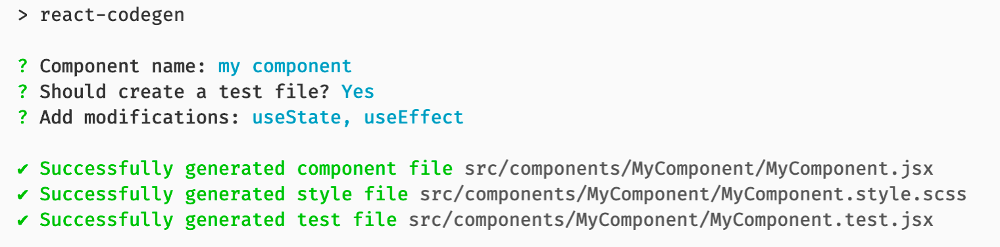

# React Codegen CLI

React Codegen is a development tool to quickly generate React components.  
It helps you to speed up productivity in React projects and stop copying, pasting files

## Installation

To install the latest version run this command:

```sh
npm install generate-react-code --save-dev
```

Then add the following script to your `packages.json` file:
```json
{
  "scripts": {
    "react-codegen": "react-codegen"
  }
}
```

## Get started

`react-codegen` will look for a [configuration file](#configration-file) in root folder and use it if available.
If no config file is found it will fallback to a default configuration.

The following command can be used to generate code:
```sh
npm run react-codegen
```

After running the command in the terminal,
you can enter the name of the component and configure the generation of the files.
When creating a react component, you are given the choice to modificate the component parts,
such as connecting the `useState`, `useEffect`, `propTypes` and so on.



## Configration file
 
Use `JSON` file to specify configuration information. This should be in the form of `react-codegen.json`.

|     Type     |                             Value                            |     Default    |                              Description                             |
|:------------:|:------------------------------------------------------------:|:--------------:|----------------------------------------------------------------------|
| styles       |                            string                            |      scss      | Extension for style file                                             |
| typescript   |                            boolean                           |      false     | Generate typescript files                                            |
| jsxExt       |                            boolean                           |      true      | Use `jsx` extension for components                                   |
| fileNameCase | came,<br/> pascal,<br/>   snake,<br/> snakeUpper,<br/> kebab |     pascal     | File name case for generated files<br/> (default: `MyComponent.jsx`) |
| path         |                            string                            | src/components | Path to generate files                                               |                                           |                                           |

Example:

```json
{
  "styles": "scss",
  "typescript": false,
  "jsxExt": true,
  "fileNameCase": "pascal",
  "path": "src/components"
}
```

## License

Generate React CLI is open source software [licensed as MIT](https://github.com/cristians953/react-codegen/blob/master/LICENSE).
